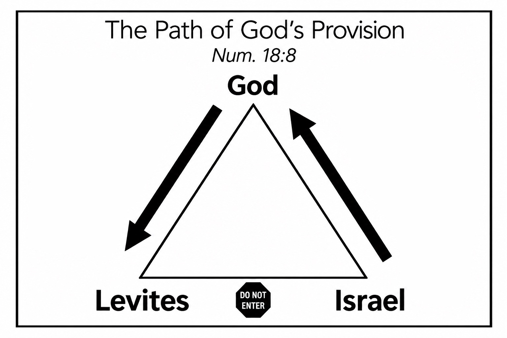

Dear friends and partners,

I still can’t believe it’s officially begun. As I begin my journey toward GCTC (staff training) and full-time campus ministry, I’m feeling some anxiety and tiredness, but most of all, excitement.

Earlier this month, I spent a week in Southern California for MPD (Ministry Partner Development) training. We learned about God’s provision and how to build a team of partners, and also had the opportunity to spend meaningful time together as the 28th GCTC class. This week prepared us for the next four months, as we reach out, meet with, and invite people to partner with us as we prepare for training.

For my first update, I thought I’d write some of the lessons and convictions God gave me throughout that week. There are many things I’d love to share, and I also want to document them as a reminder to myself for the months ahead!

## The posture of partnership

MPD, when first mentioned to people, can seem incredibly daunting, which makes sense. Living a lifestyle that is completely reliant on the support of others is unusual, and reaching out to others for that support can feel unusual as well.

There were a lot of mental adjustments we had to make before approaching partnership. One of the biggest was getting out of a “beggar mindset.” For many of us, asking for financial support felt uncomfortable because it can feel like we’re begging others for money. But we were reminded that this is far from the reality of what we’re asking people to do.

During one session, we learned about giving as a vertical relationship rather than a horizontal one. Our trainer talked about the Israelites in the book of Numbers, who gave offerings to the Lord, a portion of which provided for the Levites who served the community of Israel. The Israelites weren’t simply giving directly to the Levites. They were giving to God, who then provided for the Levites through their giving.

In the same way, we are asking our supporters to give toward the Lord, trusting that He will use their generosity to provide for the work He has called us to. It’s an invitation for people to invest in eternal treasures and to experience the fruit God is producing through our ministry.

But partnership isn’t only about the posture of receiving. We also learned about the posture of giving:

> "Each of you should give what you have decided in your heart to give, not reluctantly or under compulsion, for God loves a cheerful giver."
> <cite>— 2 Corinthians 9:7 ESV</cite>

Giving should never be an obligation or something done reluctantly, but something that flows from a cheerful heart. While giving can be challenging, it should also be a blessing to the giver. This whole process becomes much more meaningful when it is done in the Lord. He delights in cheerful giving, and I pray that the financial partnerships I enter into would be done out of the same cheerfulness.

## Victory comes from the Lord

As this season begins, I’ve found it tempting to be swayed by the highs and lows of the process, overvaluing things like how my slides look, my relationships with the people I’m sharing with, or how confidently I communicate. But one passage from Proverbs has helped me continually readjust my understanding of the process God has put before me:

> “The horse is made ready for the day of battle, but the victory belongs to the Lord.”
> <cite>— Proverbs 21:31 ESV</cite>

There is a lot that I can do. I can prepare my slides, reach out to people, have meaningful conversations, and faithfully maintain relationships. But ultimately, the victory belongs to the Lord. The highs and lows of this process are not entirely in my control, and I don’t want my confidence or discouragement to be determined by them.

The great news is that I can step into this season with total confidence, knowing God has already assured victory. He walks alongside me, and I expect Him to challenge, guide, and fully provide for every step. My role is to faithfully prepare the horse and do the work, trusting Him completely with the results.

## My vision

Maybe the most meaningful thing this week did for me was reignite my excitement for this season. It reminded me why I decided to pursue full-time ministry and refreshed my personal relationship with God. One of the exercises we spent a lot of time on was crafting our vision and learning how to share it with others.

Being so far removed from the school year and from my time in missions, it had become harder and harder to remember my “why” and the reason I was so excited to enter into staff training and college ministry.

But through this week, I was reminded of my dream to win, build, and send college students, the future leaders of the world. College ministry is so special because an investment in even one campus can reach so many corners of the globe as students are naturally sent into different careers, communities, and countries. I can only imagine what could happen if the future leaders of the world had strong, personal relationships with God.

At the same time, reading *The God Ask* has reminded me just how important my personal relationship with God is throughout this entire process:

> “The strength of your **public** support raising is directly tied to the strength of your **private** relationship with God.”
> <cite>— *The God Ask*, Steve Shadrach</cite>

Even being home for a short period of time after training, I’ve already seen how difficult it can be to maintain an intentional walk with God without the busyness and accountability I had around me during training and in Boston. Please pray for me as I do my best to invite God into this space, strengthen my relationship with Him, and surround myself with brothers and sisters in Christ who can encourage and keep me accountable.

## What's next

Over the next four months I'll be focusing on raising support, reaching out to old friends and new faces alike, and creating a team of prayerful and financial supporters that share my vision for the college students I'll be ministering to.

I’m excited to use this site to keep you all updated throughout that process, and share how I see God actively moving and working! Thank you for taking the time to visit and read! My goal is to publish a new update once every month, at least throughout the duration of my training!

Thank you as well for praying, for giving, and for joining me in pursuing my vision for this “powerful percent” of college students. I step in confidence knowing that people like you are covering me in prayer.

## How you can pray

- For focus and humility. That I would stay focused on God and humble throughout this whole process, abiding first in His Spirit, trusting Him with the results, and remembering that He is the One who provides, not anything I can accomplish on my own.
- For my MPD process. That God would reveal willing and cheerful supporters who would help me reach my goal, and that they would grow deeper in their relationship with Him through this process as well.
- For diligence, accountability, and spiritual protection. Especially while I’m at home, that I would not become distracted or isolated, but seek accountability and remain open with others about how I’m doing. Pray that I would steward these four months that God has given me to the best of my ability and remain faithful to what He has called me to do.

